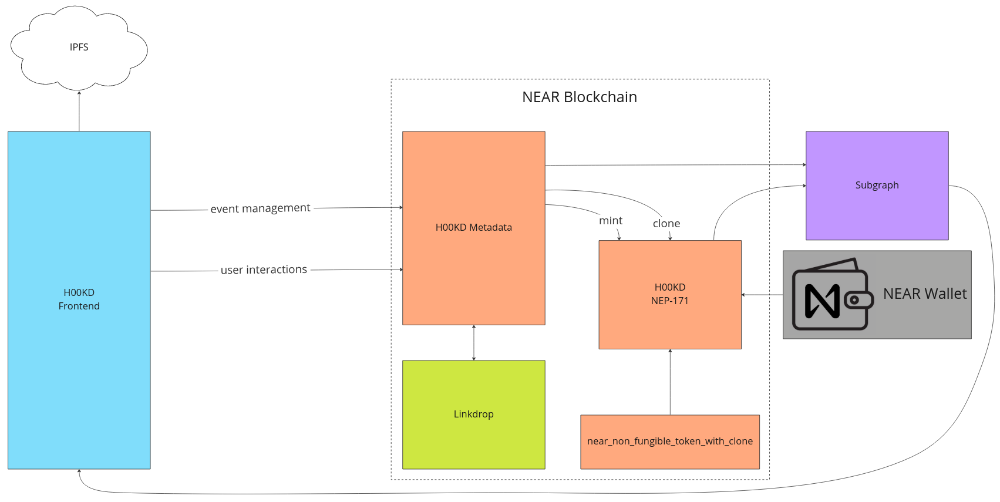
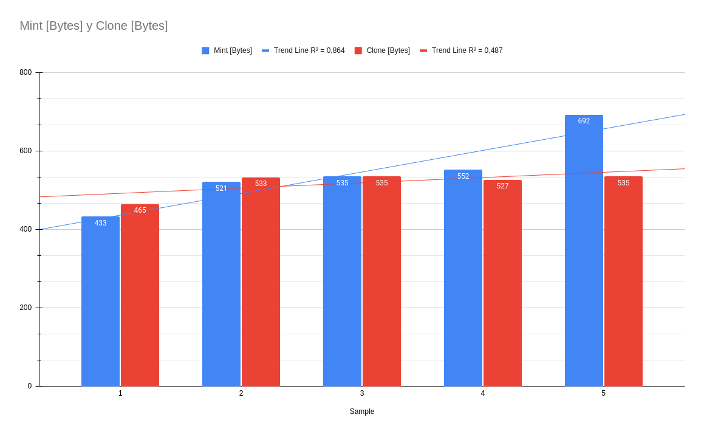
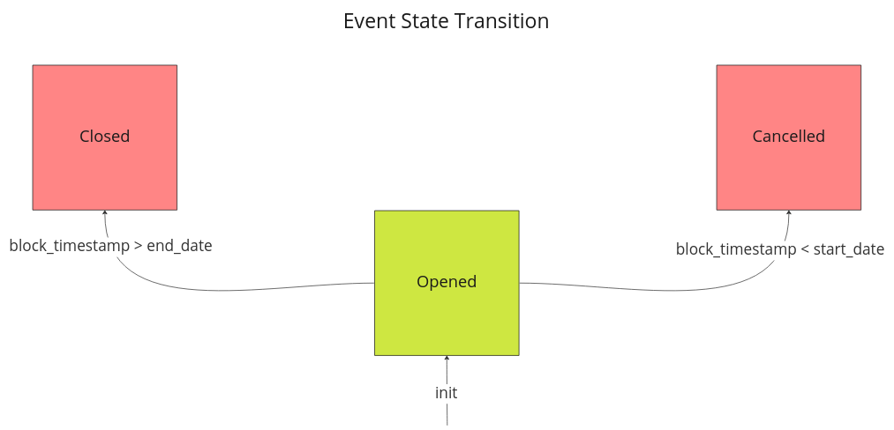
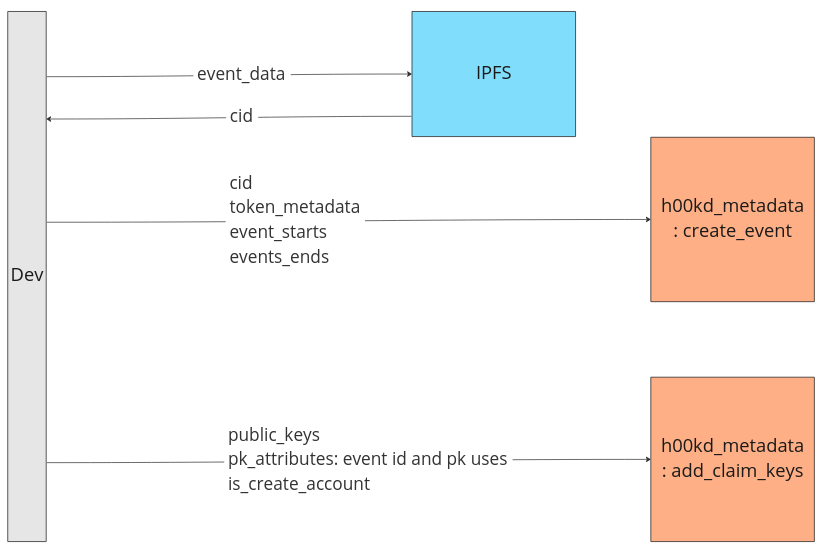

# Architecture

<!-- Necessary comment to make work below header tag -->

## Overview

The Token Metadata is the structure that contains all the data related to a certain NFT. Since most of the NFTs that user will claim are very similar to each other, this data sits on the "genesis" token exclusively. When reading a cloned token, the metadata is fetched from the genesis token, thus it does not ocupy unnecessary storage and NFTs are even cheaper to create.



## H00KD

The [H00KD](./contracts/h00kd.md) contract implements the [NEP-171](https://github.com/near/NEPs/blob/master/neps/nep-0171.md) standard in order to manage and store NFTs. On top of all NEP-171 functionalities, we added an optimization layer that allows us to reduce the storage costs and enable event owners to create NFTs cheaper than ever.

### Clone

- [Source](https://github.com/shard-Labs/near_non_fungible_token_with_clone/)

The contract implements a new functionality to optimize minting new NFTs using a "root" or "genesis" token. This new feature is called "Clonable NFTs" and its main goal is to save storage and improve gas costs on all claim transactions.

#### Impact of clonable NFTs on storage and gas costs

The mint mechanism presents some inefficiencies when it comes to our use case. We know that on a Cross Contract Call scenario, increasing the arguments within any method will increase as well the gas costs of a recipe.

A way to minimize the gas costs on H00KD is to reduce the size of recipes on claiming new NFTs. To achieve that, we created a so called "genesis token" on creating a new event. Thus, we can use the genesis token to replicate or clone it multiple times without spending additional gas.

In addition to the previous improvment, cloned NFTs only store the id and owner information. All additional infomation about the NFT is hosted on the genesis token and it can be fetched on demand.

#### Storage comparison



After experimenting with both mechanisms, we found that, for a reasonabe NFT data size, cloning NFTs is being more efficient in comparison to minting new NFTs, where the cost storage increases drastically.

## H00KD Metadata

The [H00KD Metadata](./contracts/h00kd_metadata.md) contract's role is to manage all the events created and enable users create NEAR accounts and claim new NFTs.

### Event State Transition



All events have three possible states. Each state indicates also what kind of actions can be done for a particular event.

#### Opened

Opened event is the initial state of all events. On this state, the owner can add new public keys linked to the event and users can claim or create NEAR accounts.

#### Closed

A closed event indicated that the event has ended. An event can move to this state only of the block time is higher than the event end date. After the transition, all remaining allocated funds are sent back to the event owner.

#### Cancelled

A cancelled evend indicated that the event has been cancelled. An event canm move to this state only if the block time is lower thant the event start date. After the transition, all the allocated funds are sent back to the event owner.

**Note: after closing or cancelling an event, all interactions with that event are disabled**

## Linkdrop

- [Source code](https://github.com/near/near-linkdrop)
- [Method](https://github.com/near/near-linkdrop/blob/master/src/lib.rs#L127)

H00KD make use of the Linkdrop contract to create new NEAR accounts. The Linkdrop contract allows any user or contract to create a new NEAR account by making use of the `create_account` method.

## Crate new event and adding public keys

Previously to interacting with the contract, the event data needs to be stored on IPFS. The CID is needed to be stored within the contrac for traceability reasons. The CID is currently being used to querry the event data using GraphQL, so make sure you are using the [CID V1](https://docs.ipfs.tech/concepts/content-addressing/#version-1-v1) format.

Here's an example of how one can store event data on IPFS using JS.

```js
import * as IPFS from 'ipfs-core'

let IPFS_event_data = {
  title: 'Event Title',
  description: 'description',
  tags: 'tags',
  country: 'country',
  city: 'city',
  date_from: 1000000000,
  date_to: 10000000000000000,
  image: 'some image',
  links: 'links to event',
}

const fileAdded = await node.add({
  path: `${nearNetworkId}_event_${element.event_id}.json`,
  content: JSON.stringify(IPFS_event_data),
})
```

The create event method accepts four arguments: cid, token_metadata, start date and end date.


