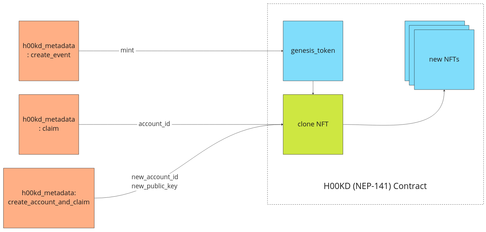

# Architecture

<!-- Necessary comment to make work below header tag -->

## H00KD

## Clone

The contract implements a new functionality that allows new NFT to be created out of a "root" or "genesis" token. The advantage of using clonable NFTs is to save storage on our H00KD contract. The Token Metadata is the structure that contains all the data related to a certain NFT. Since most of the NFTs that user will claim are very similar to each other, this data sits on the "genesis" token exclusively. When reading a cloned token, the metadata is fetched from the genesis token, thus it does not ocupy unnecessary storage and NFTs are even cheaper to create.

### Here's how it works

## H00KD Metadata

TODO: Some generic decription...

## Event State Transition

All events have three possible states. Each state indicates also what kind of actions can be done for a particular event.

### Opened

Opened event is the initial state of all events. On this state, the owner can add new public keys linked to the event and users can claim or create NEAR accounts.

### Closed

A closed event indicated that the event has ended. An event can move to this state only of the block time is higher than the event end date. After the transition, all remaining allocated funds are sent back to the event owner.

### Cancelled

A cancelled evend indicated that the event has been cancelled. An event canm move to this state only if the block time is lower thant the event start date. After the transition, all the allocated funds are sent back to the event owner.

**Note: after closing or cancelling an event, all interactions with that event are disabled**

## Crate new event and adding public keys

Previously to interacting with the contract, the event data needs to be stored on IPFS. The CID is needed to be stored within the contrac for traceability reasons.

The create event method accepts four arguments: cid, token_metadata, start date and end date.

