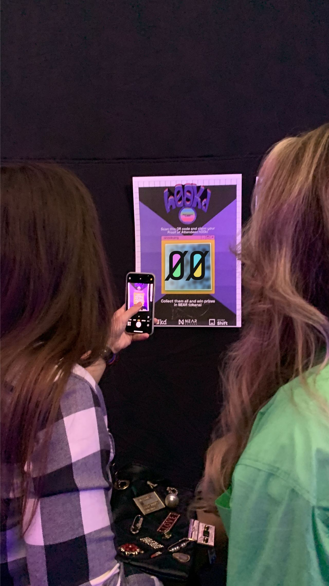
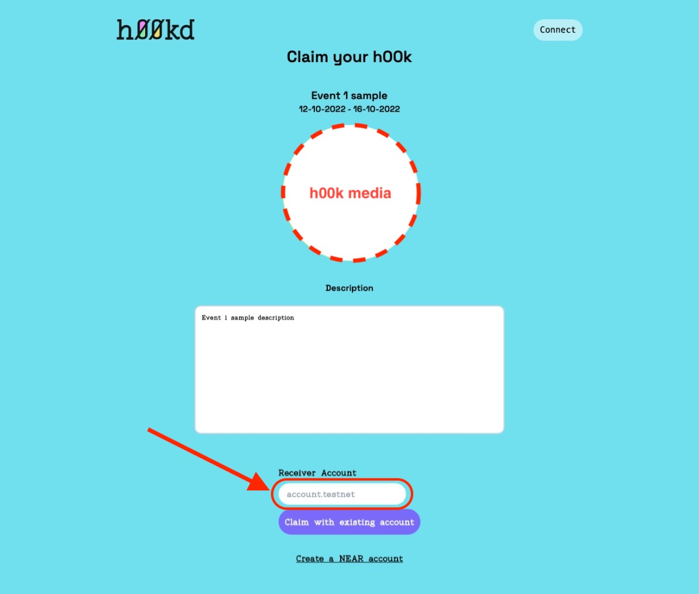

# How to claim a h00k

To claim a h00k and have it displayed on your gallery, you simply need to:

### Step 1: Get a valid claim link

First, you must have a valid claim link.
Claim links are provided by h00k issuers (event organizers) and usually come in one of these two formats (Link, QRCode).

#### Link

[**APP_URL**]/claim?type=[**operationType**]&key=[**privateKey**]

- **APP_URL**: h00kd platform URL.
- **operation**: a parameter specifying the type of operation (**simple claim** or NEAR Wallet creation and claim).
- **key**: private key used to claim.

Open the link in a web browser and type in your NEAR Wallet username in the field.
Then, click on **claim** button.

#### QRCode

Scan the QRCode using a scanning app to open the link in a web browser and type in your NEAR Wallet username in the field.
Then, click on **claim** button.

### Step 2: Submit collector's NEAR Wallet

On the page loaded, enter your NEAR wallet address and click on Claim with existing account (in case you don't already have a NEAR account check [How to create NEAR wallet and claim guide](./how-to-create-and-claim) or [Guide to create NEAR wallet](https://wiki.near.org/getting-started/creating-a-near-wallet)).

After successfully claiming the h00k you can check it out on your gallery ([Where to view your h00ks guide](./where-to-view-h00ks)).
