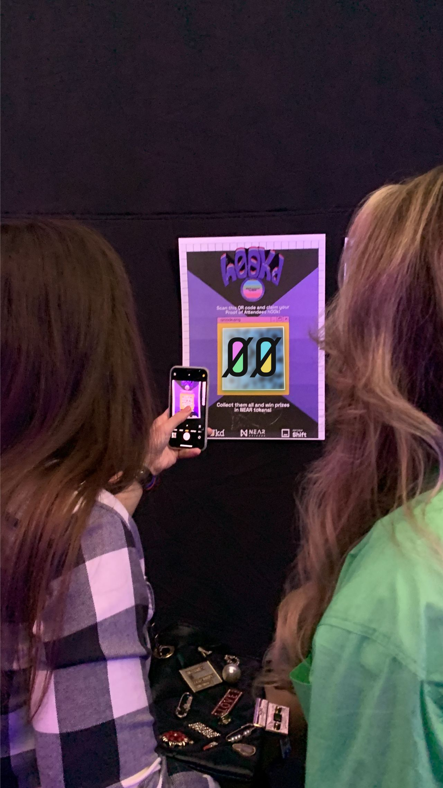

# How to create a NEAR wallet and claim a h00k

To claim a h00k and have it displayed on your gallery, you simply need to:

### Step 1: Get a valid claim link

First, you must be in possession of a valid claim link.
Claim links are provided by h00k issuers (event organizers) and usually come in one of these two formats (Link, QRCode).

#### Link

[**APP_URL**]/claim?type=[**operationType**]&key=[**privateKey**]

- **APP_URL**: h00kd platform URL.
- **operation**: a parameter specifying the type of operation (simple claim or NEAR Wallet **creation and claim**).
- **key**: private key used to claim.

Open the link in a web browser and type in your NEAR Wallet username in the field.
Then, click on claim button.

#### QRCode

Scan the QRCode using a scanning app to open the link in a web browser and type in your NEAR Wallet username in the field.
Then, click on **claim** button.

### Step 2: Open claim page

Click on **Claim with NEAR Wallet**.

NEAR Wallet linkdrop is opened, next click on **Claim with New Account**.

Clicking on **Claim with New Account** opens the steps to create a new NEAR Wallet (see [Guide to create NEAR wallet](https://wiki.near.org/getting-started/creating-a-near-wallet)).

After creating a NEAR Wallet, the drop will be automatically claimed.

