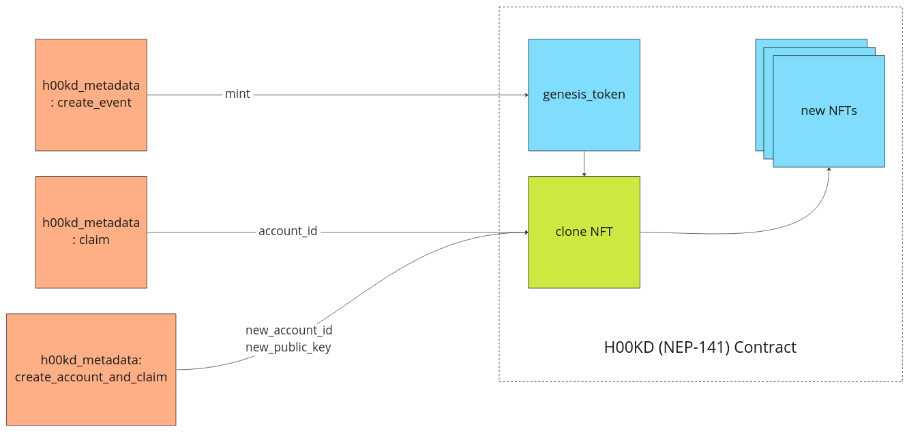

# H00KD

<!-- Necessary comment to make work below header tag -->

## Overview

## Clone

The contract implements a new functionality that allows new NFT to be created out of a "root" or "genesis" token. The advantage of using clonable NFTs is to save storage on our H00KD contract. The Token Metadata is the structure that contains all the data related to a certain NFT. Since most of the NFTs that user will claim are very similar to each other, this data sits on the "genesis" token exclusively. When reading a cloned token, the metadata is fetched from the genesis token, thus it does not ocupy unnecessary storage and NFTs are even cheaper to create.

### Here's how it works

