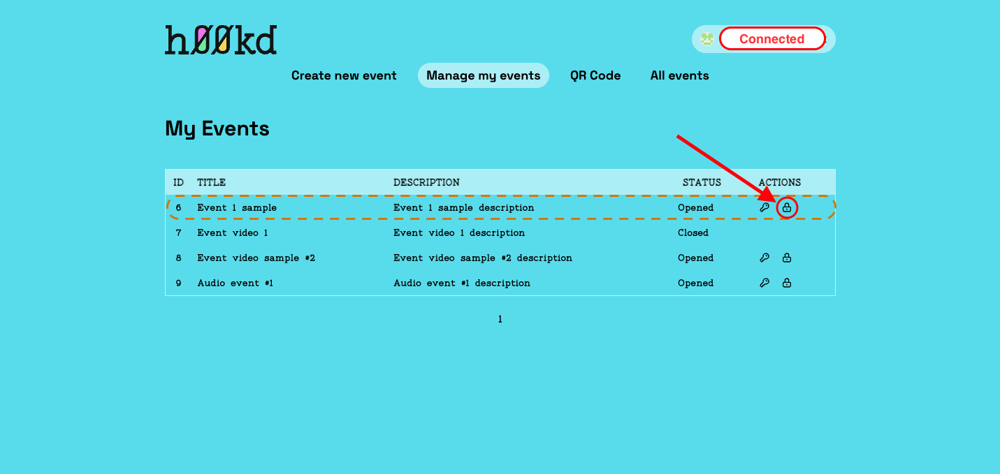

# How to close an event

You may want to close or cancel an event, closing an event is a simple process.

## Step 1: Connect wallet

Connect your near using the connect button at the top right corner, in case you don’t already have a NEAR Wallet follow this [guide](https://wiki.near.org/getting-started/creating-a-near-wallet) to learn how to create one.

## Step 2: Navigate to page

Navigate to [manage events page](https://app.h00kd.com/admin/manage), there you will find a table containing the list of events created by the connected wallet.

## Step 3: Open modal

On the row of the event you intend to close, click on lock icon on ‘Actions’ column which will open a modal.

## Step 4: Confirm cancelation

The modal prompt you to confirm the closing/cancelation of the event.

Closing an event grant you back the unused NEAR.

:::info

When you close an event, h00ks that have already been claimed won't be removed from their collectors' gallery.

:::

:::caution

After you close an event, you will no longer be able to re-open it and therefore won't be able to generate new keys for it.

:::
