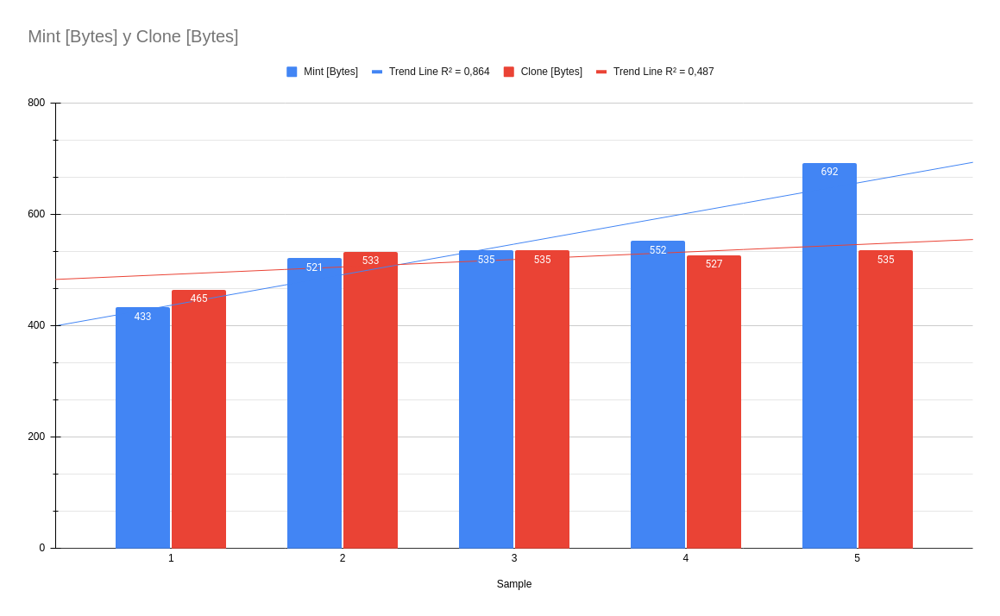

# Architecture

<!-- Necessary comment to make work below header tag -->

## Overview

H00KD composed of three contracts, one of which is external. The external [Linkdrop](#linkdrop) contract is used to create new NEAR accounts and it is being called on very specific situations. The remaining two contracts constitute the main functionalities of H00KD. [H00KD Metadata](#h00kd-metadata) contract manages all the events, from creating new events, adding new public keys and closing or canceling events. Lastly, [H00KD](#h00kd) contract is a [NEP-171](https://github.com/near/NEPs/blob/master/neps/nep-0171.md) contract with an additional complexity layer that optimizes storage and gas costs.

## Linkdrop

- [Source code](https://github.com/near/near-linkdrop)
- [Method](https://github.com/near/near-linkdrop/blob/master/src/lib.rs#L127)

H00KD make use of the Linkdrop contract to create new NEAR accounts. The Linkdrop contract allows any user or contracts to create a new NEAR account by making use of the `create_account` method.

## H00KD Metadata

The [H00KD Metadata](../contracts/h00kd_metadata.md) contract's role is to manage all the events created and enable users create NEAR accounts and claim new NFTs.

### Create new event and adding public keys

When creating a new event, the event data is being stored on IPFS [(example)](./ipfs.md). Once the event data's CID is obtained, it will be stored on the contract along side with the [genesis token](#genesis-token) metadata and the event start/end date.

### Event State Transition

All events have three possible states. Each state indicates also what kind of actions can be done for a particular event.

#### Opened

Opened event is the initial state of all events. On this state, the owner can add new public keys linked to the event and users can claim or create NEAR accounts.

#### Closed

A closed event indicated that the event has ended. An event can move to this state only of the block time is higher than the event end date. After the transition, all remaining allocated funds are sent back to the event owner.

#### Cancelled

A cancelled evend indicated that the event has been cancelled. An event canm move to this state only if the block time is lower thant the event start date. After the transition, all the allocated funds are sent back to the event owner.

**Note: after closing or cancelling an event, all interactions with that event are disabled**

## H00KD

The [H00KD](../contracts/h00kd.md) contract implements the NEP-171 standard in order to manage and store NFTs. On top of all NEP-171 functionalities, we added an optimization layer that allows us to reduce the storage costs and enable event owners to create NFTs cheaper than ever.

### Clone

- [Source](https://github.com/shard-Labs/near_non_fungible_token_with_clone/)

The contract implements a new functionality to optimize minting new NFTs using a "root" or "genesis" token. This new feature is called "Clonable NFTs" and its main goal is to save storage and improve gas costs on all claim transactions.

#### Genesis Token

To completely optimize the storage costs of cloned NFTs and avoid duplicated data, all data related to any NFT is stored within the geneis token, which is minted on event creation. The only data a cloned NFT stores is the token id and the owner account id. Thus, when fetching any NFT from the contract, data from genesis token is used to complement the cloned NFT data.

#### Impact of clonable NFTs on storage and gas costs

After experimenting with both mechanisms, we found that, for a reasonabe NFT data size, cloning NFTs is being more efficient in comparison to minting new NFTs, where the cost storage increases drastically.
