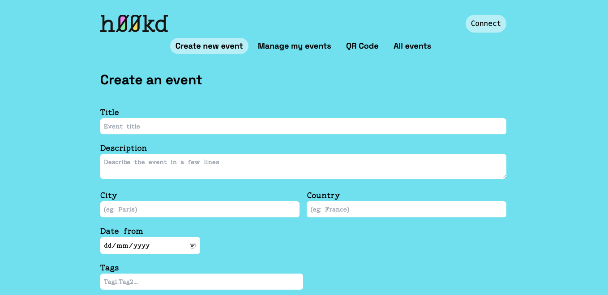
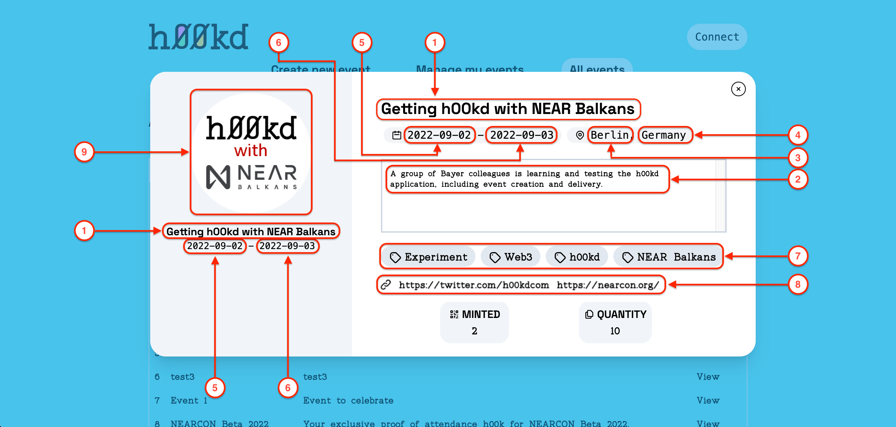

# How to create an event

Creating an event is the first step required toward having h00ks (collectibles) ready for claiming.

### Step 1: Connect wallet

Connect your near using the connect button at the top right corner, in case you don’t already have a NEAR Wallet follow this [guide](https://wiki.near.org/getting-started/creating-a-near-wallet) to learn how to create one.

### Step 2: Navigate to page

To begin, navigate to [events creation](https://app.h00kd.com/admin/create). This page contains the form used to create events

### Step 3: Fill the form

Once connected to hookd platform with your NEAR wallet, next step is to fill the form fields with appropriate details

| #   | Field (\* required) | Description                                 |
| --- | ------------------- | ------------------------------------------- |
| 1   | Title\*             | Title given to the event and NFT            |
| 2   | Description\*       | (preferably short) description of the event |
| 3   | City                | City in which the event took place          |
| 4   | Country             | Country in which the event took place       |
| 5   | Date from           | Date on which the event started             |
| 6   | Date to             | Date on which the event ended               |
| 7   | Tags                | Keywords related to the topic of the event  |
| 8   | Links               | Links to event related resources            |
| 9   | Media\*             | Media file attached to the h00k             |

Details filled here will be present to collectors on the h00k preview modal

### Step 4: Submit

After filling in all the event details, the next step is to submit by clicking on the Create button at the bottom of the form.

:::tip

On the create button you can see an approximate estimation of how much NEAR will your event creation transaction will cost you.
Transaction fees depend on the total number of characters making the event details.

:::

After submitting, you will be redirected to NEAR wallet to sign the transaction.
