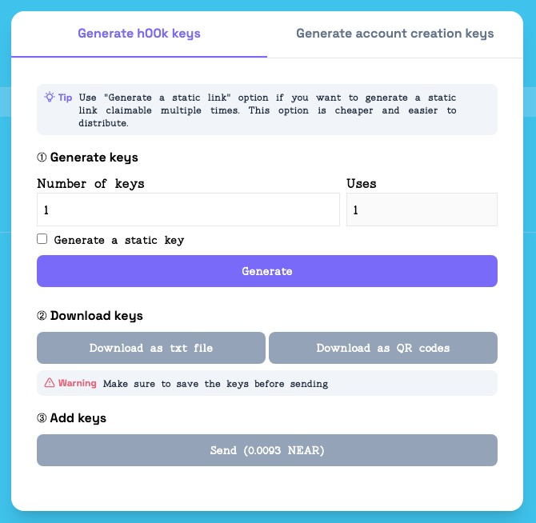

# How to generate keys

After you have created an event (follow this [guide](./how-to-create-event) on how to create an event) and you want to distribute it to h00k to your collectors. In this guide we will go through all steps needed to generate the keys used to claim your event’s h00k. follow along:

### Step 1: Connect wallet

Connect your near using the connect button at the top right corner, in case you don’t already have a NEAR Wallet follow this [guide](https://wiki.near.org/getting-started/creating-a-near-wallet) to learn how to create one.

### Step 2: Navigate to page

Navigate to [manage events](https://app.h00kd.com/admin/manage), This page contains the list of events created using the currently connected NEAR Wallet.

### Step 3: Open modal

On the row of the event you want to generate new claim keys for, click on key icon on ‘Actions’ column.

### Step 4: Save and submit generated keys

After opening the modal, you choose between generating two types of keys:

- **Regular keys:** are keys that have a single use, meaning that each collector should get a unique key valid for only one claim operation.
- **Static keys:** are keys that have a set amount of uses, meaning that a group of collectors can use the same key to do multiple claim operations.

:::tip

Use “Generate a static key” option if you want to generate a static link claimable multiple times. This option is cheaper and easier to distribute

:::

Key generating is a three steps process:

- **First**, pick the number of unique keys you want to generate. (in case of static keys, you pick number of uses for one single key) and click on `Generate`.
- **Second**, you download the claim links generated either in a text format (txt file) or a QRCode in an zip containing images (png file).
- **Lastly**, you submit the generated keys using the `Send` at the bottom of the form, then you will be redirected to NEAR wallet to sign the transaction.

:::caution

Make sure to have saved the keys in a safe location before submitting them, as there's no other way to retrieve them.

:::

Keys are exported as a link with the following format [**APP_URL**]/claim?type=[**operationType**]&key=[**privateKey**]

- **APP_URL**: h00kd platform URL.
- **operation**: a parameter specifying the type of operation (simple claim or NEAR Wallet creation and claim).
- **key**: private key used to claim.
