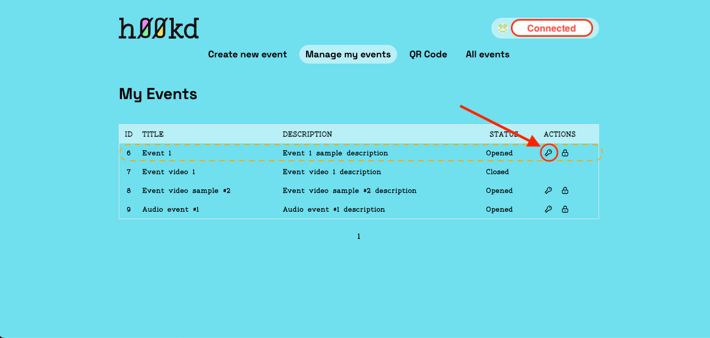

# How to generate keys with wallet creation

After you have created an event (follow this guide on how to create an event) and you want to distribute it to h00k to your collectors. In this guide we will go through all steps needed to generate the keys used to claim your event’s h00k. follow along:

### Step 1

Connect your NEAR Wallet to h00kd platform using the connect button at the top right corner.

### Step 2

Navigate to [manage events](https://app.h00kd.com/admin/manage), This page contains the list of events created using the currently connected NEAR Wallet.

### Step 3

On the row of the event you want to generate new claim keys for, click on key icon on ‘Actions’ column.

### Step 4

Key generating is a three steps process:

- **First**, pick the number of unique keys you want to generate. (in case of static keys, you pick number of uses for one single key) and click on `Generate`.
- **Second**, you download the claim links generated either in a text format (txt file) or a QRCode in an zip containing images (png file).
- **Lastly**, you submit the generated keys using the `Send` at the bottom of the form, then you will be redirected to NEAR wallet to sign the transaction.

:::caution

Make sure to have saved the keys in a safe location before submitting them, as there's no other way to retrieve them.

:::

Keys are exported as a link with the following format [**APP_URL**]/claim?type=[**operationType**]&key=[**privateKey**]

- **APP_URL**: h00kd platform URL.
- **operation**: a parameter specifying the type of operation (simple claim or NEAR Wallet creation and claim).
- **key**: private key used to claim.
